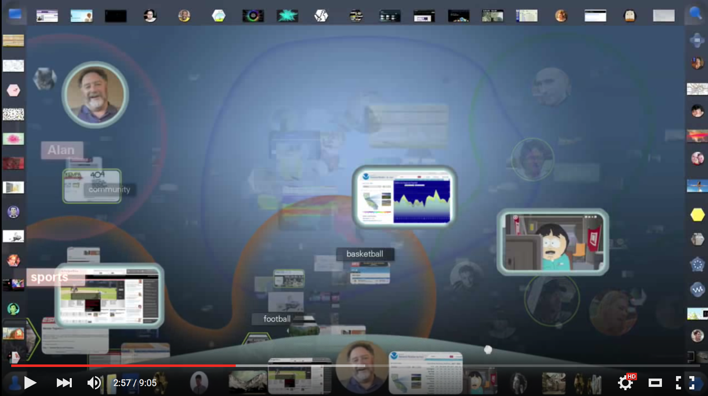

# About Me

Hi,
I'm [Dumindu Madunuwan](https://lk.linkedin.com/in/dumindunuwan). I'm a web developer, mainly PHP.  

Around 2007–2009, I chose web development because at that time I truly believed, web will be the next ultimate, system independent & language independent platform and the next generation software ecosystem will be implemented top of browsers. The web I expected is sort of similar to this.

Like some of web developers, I truly bet on HTML5 over native apps on past years. I learned about HTML5, CSS3, RWD, Mobile First Design, UI/UX and etc. Now a days we have hundreds of front-end frameworks but still web technologies can't win over native apps, especially on performance.

It’s true that web technologies are slowly adapting for native app development via asmjs, NativeScript, Electron, WebAssembly, React Native but future web application development will be more complex because of Emerging Connected Cars and VR Ecosystems.

Also in the other hand, now we have much powerful alternatives for PHP, like node and Go. So as a PHP developer its time to learn something new, a new language. I chose Rust because it's an interesting language to learn and next generation browser engine, [Servo](https://servo.org/) is written using Rust. 

---

